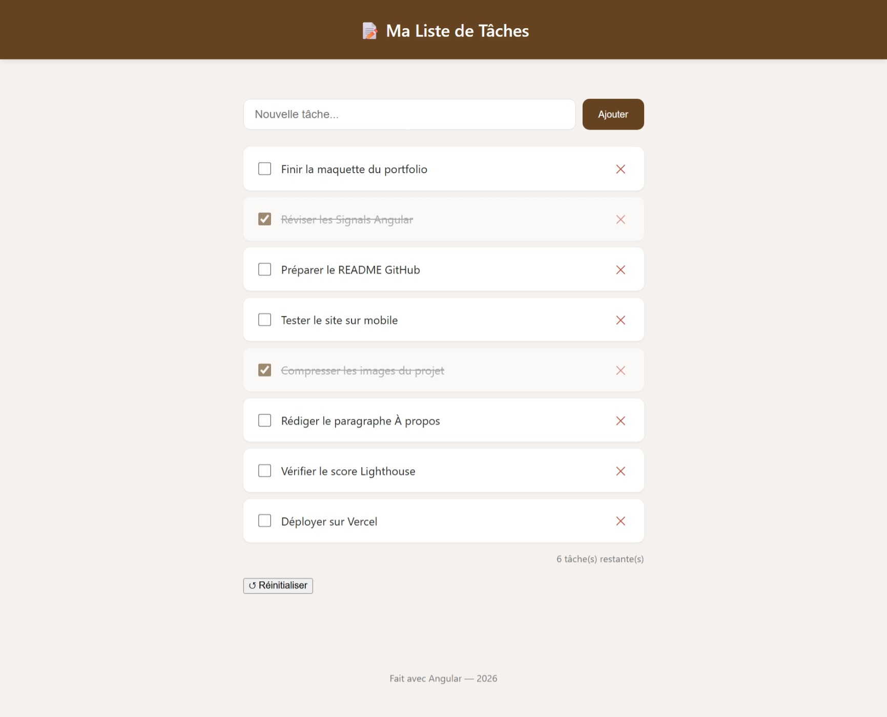
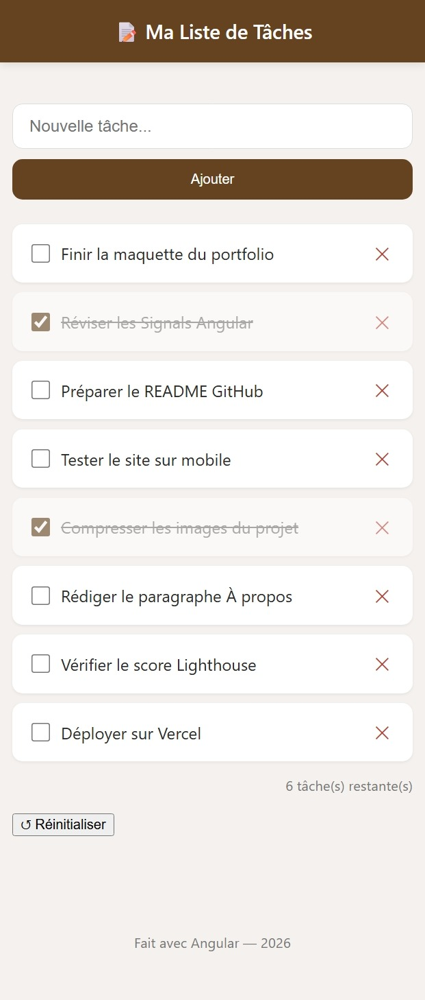

# 📝 Gestion de Tâches

Application Angular moderne (Signals, `httpResource`, services) pour gérer une liste de tâches personnelle avec sauvegarde locale.
### Desktop

### Mobile

## Technologies utilisées
- Angular 22.0.1
- TypeScript 5.9+
- npm 11.17.0

## Fonctionnalités
- Ajouter, cocher, supprimer des tâches
- Compteur de tâches restantes
- Persistance automatique (localStorage) — les données survivent au rafraîchissement
- Chargement initial simulé depuis un "serveur" JSON

## Stack technique
- Angular (dernière version), composants standalone
- Signals (`signal`, `computed`, `effect`) pour tout l'état
- `httpResource()` pour le chargement asynchrone
- `inject()` — pas de constructeur, pas de `ngOnInit`

## Lancer le projet
\`\`\`bash
npm install
ng serve -o
\`\`\`

## Démo
[(https://gestionaire-de-taches.vercel.app/)]

## Auteur
[PANKUI KAMTCHA MESMINE CHANELLE] — Apprenant Angular Talent Lab 2026 — Cohorte Douala